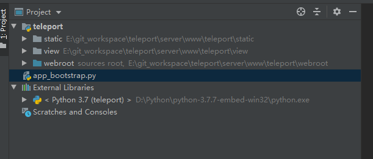
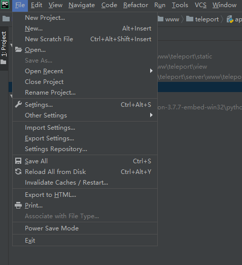
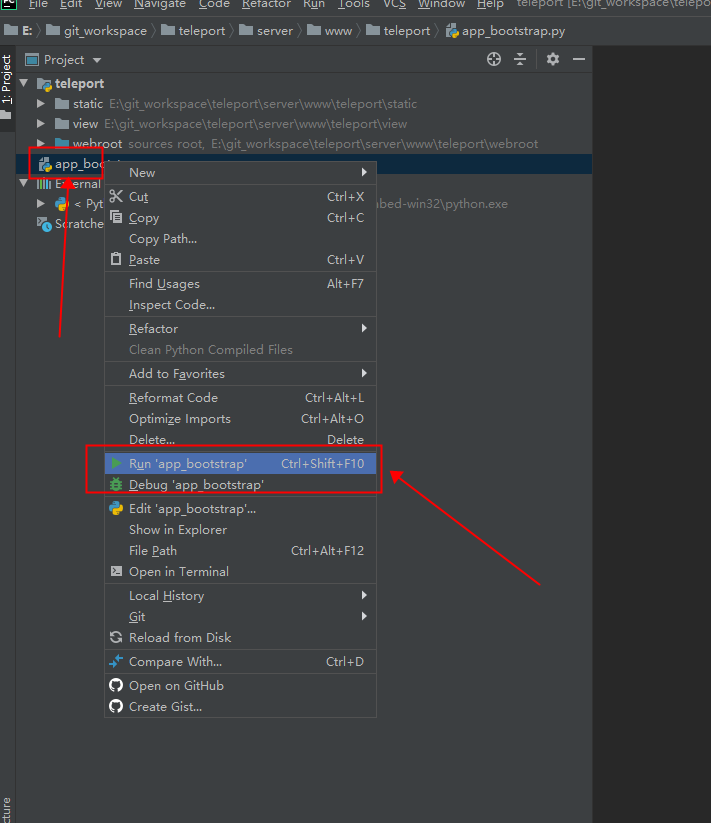

本文主要讲解如何在 Windows 平台搭建 teleport 的 WEB 开发/调试 环境。

## 基本信息

- 代码位置：`git@github.com:tp4a/teleport.git`
- python环境：**32位**的python3.7版本
- 开发环境：`PyCharm`

## 搭建过程

拉取代码

```
cd E:\git_workspace\teleport
git clone git@github.com:tp4a/teleport.git
```

2、下载python3.7的32位版本，下载embed版本即可（因为小）

[下载 python-3.7.7-embed-win32.zip](https://www.python.org/ftp/python/3.7.7/python-3.7.7-embed-win32.zip)

3、下载PyCharm并安装

下载地址：[http://www.jetbrains.com/pycharm/download/](http://www.jetbrains.com/pycharm/download/)

[查看PyCharm的简单安装教程](https://www.jianshu.com/p/bf14e7634d30)

4、配置开发环境

**配置Python**

将python解压到本地目录 `D:\Python\python-3.7.7-embed-win32\` 下

在这个文件夹下，创建一个新文件，名字为：`dev_mode`，**注意不能有扩展名，与python.exe同级**。

启动PyCharm，导入teleport的web项目：



**配置PyCharm的Python解释器**

主菜单，File / Settings...



在 Project teleport 下选择 Project Interpreter，然后右侧设置刚刚安装的Python：


**配置web.ini文件**

在目录 `E:\git_workspace\teleport\server\share\etc` 下，拷贝 `web.ini.in`，同文件夹下重命名为 `web.ini` 即可。

然后，在PyCharm中，启动项目：



最后，浏览器访问：`http://127.0.0.1:7190`

打完收工。
