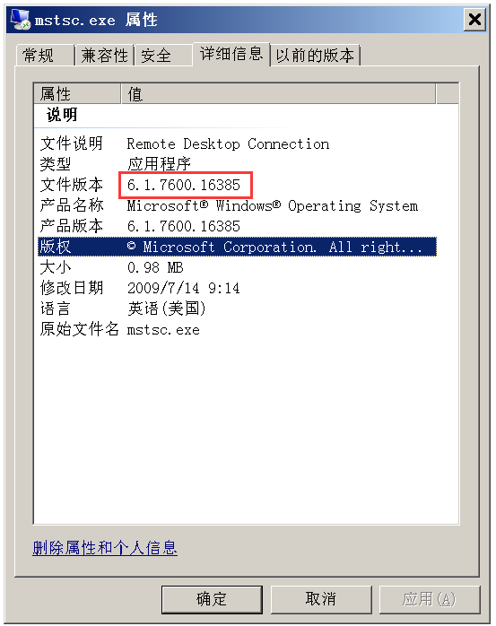
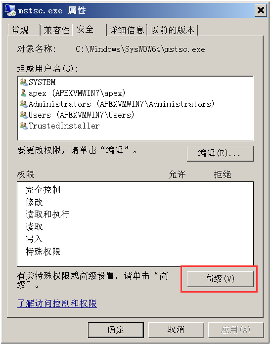
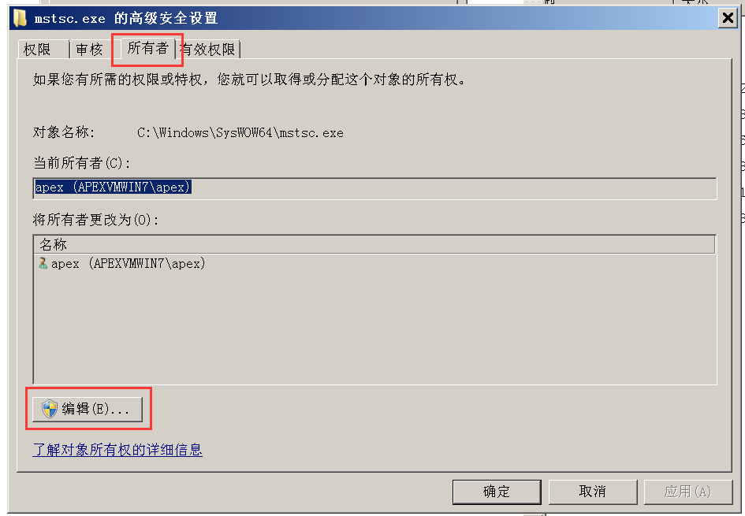
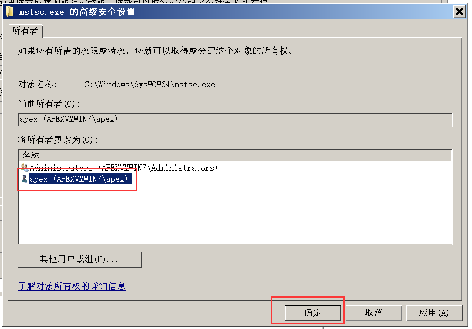
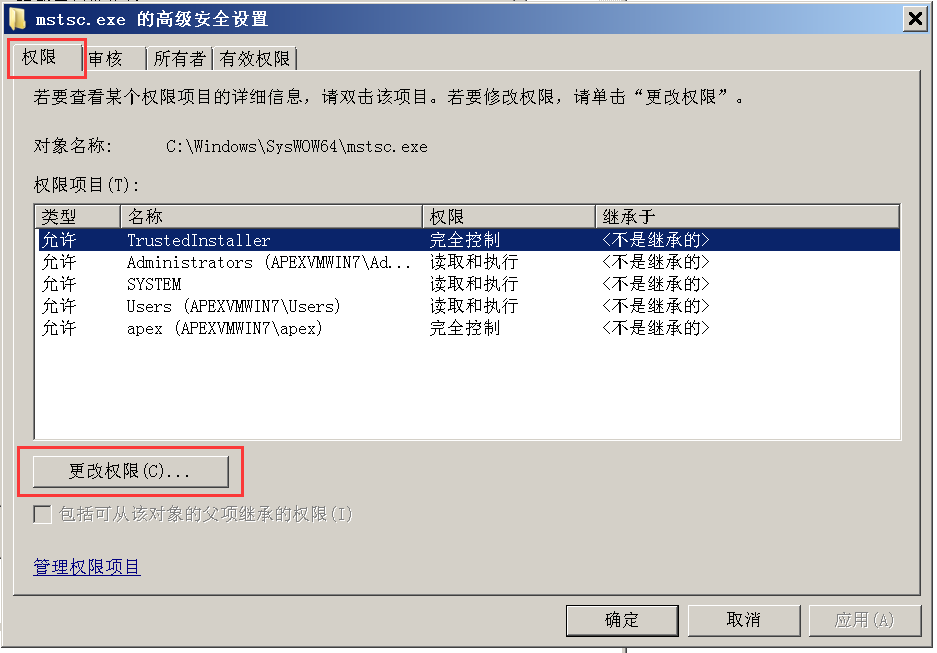
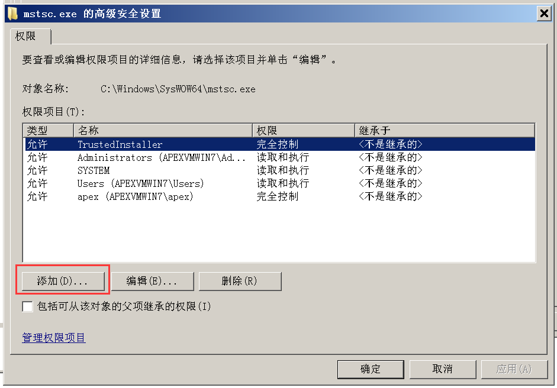
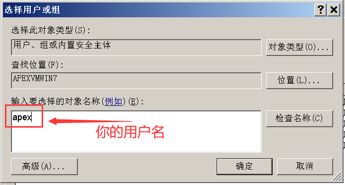
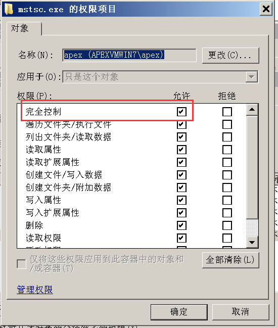

# 如何解决WIN7的mstsc无法复制粘贴

**本文针对 v3.5.5 及以上版本进行说明。**

## 一、原因

其实我也不知道原因，有哪位同学知道的话请补充。

## 二、解决办法

经过试验，将Win2012R2系统自带的mstsc复制到Win7系统上，就可以正常的复制粘贴了。

[点击这里下载Win2012R2版mstsc](https://www.tp4a.com/static/download/mstsc-win2012R2-x86.zip)。

但是等一下，你可能无法直接替换系统目录中的mstsc.exe及相关文件，因为这些文件是需要 `TrustInstaller` 用户才可以替换的。别着急，请按下面的详细步骤进行操作。

## 三、详细步骤

### 3.1 确认版本号

首先进入到系统的 `System32` 目录下（默认安装的系统，应该在 `C:\Windows\System32`），找到 `mstsc.exe` 文件。在文件上点击鼠标右键，弹出菜单中选择“属性”。然后在“详细信息”一栏中，查看文件版本，Win7自带的mstsc的文件版本应该是 `6.1.7600`，如下图所示：

### 3.2 获取文件完全控制权限

在属性对话框的“安全”一栏中，点击下方的“高级”按钮：

弹出高级安全设置对话框，在“所有者”一栏中，默认当前所有者是“TrustInstaller”，下图是因为我已经修改过所有者了，所以显示的是我自己的用户名，我们需要将其改为当前登录系统的用户账号。点击下方的“编辑”按钮：

在下方会列出系统中的用户（包括管理员和普通用户），选择你自己的用户名，然后点击“确定”。如果你的用户名没有列出，可以点击“其他用户或组”，在其中填写你自己的账户名称。

然后一路“确认”，再确认，再确认......直到所有属性对话框全部关闭为止！

- 直到所有属性对话框全部关闭为止！
- 直到所有属性对话框全部关闭为止！
- 直到所有属性对话框全部关闭为止！

重要的事情说三遍！！！

然后，重新在文件上点击右键，打开属性对话框，进入高级安全设置，这次选择“权限”一栏，点击下方的“更改权限”：

然后点击下方的“添加”按钮，弹出“选择用户或组”对话框：

然后输入你自己的登录账号：

点击确定后，会出现“权限项目”对话框：

在这里，将“完全控制”后面的“允许”勾选上（其他所有权限就会自动勾选“允许”项），然后一路确定。

再确定，再确定......直到属性对话框全部关闭为止。

恭喜你，你现在拥有 mstsc.exe 这个文件的所有权限，包括改名、删除等等。

### 3.3 接下来才是重点

#### 3.3.1 针对64位Win7系统

如果你使用的是64位的Win7系统（有`C:\Windows\SysWOW64`目录存在），请先获取下列文件的完全控制权限：

- `C:\Windows\System32\mstsc.exe`
- `C:\Windows\SysWOW64\mstsc.exe`
- `C:\Windows\SysWOW64\mstscax.dll`
- `C:\Windows\SysWOW64\zh-CN\mstsc.exe.mui`
- `C:\Windows\SysWOW64\zh-CN\mstscax.dll.mui`

将上述五个文件删除或改名（建议改个名字就好）。然后将最开始下载的压缩包解压缩，将其中的文件一一对应，替换 `SysWOW64` 目录下的的对应文件。

**非常重要：替换的是`SysWOW64`中的对应的文件！不要搞错了！**

#### 3.3.2 针对32位Win7系统

如果你使用的是32位的Win7系统（只有`C:\Windows\System32`目录，没有`C:\Windows\SysWOW64`目录），请先获取下列文件的完全控制权限：

- `C:\Windows\System32\mstsc.exe`
- `C:\Windows\System32\mstscax.dll`
- `C:\Windows\System32\zh-CN\mstsc.exe.mui`
- `C:\Windows\System32\zh-CN\mstscax.dll.mui`

将上述四个文件删除或改名（建议改个名字就好）。然后将最开始下载的压缩包解压缩，将其中的文件一一对应替换掉。

### 3.4 然后呢？

然后就可以通过teleport远程连接，并且能够复制粘贴了！

额外说明一下，如果此时远程连接上了，还是无法复制粘贴，请查看你Win7系统中是否运行了 `rdpclip.exe` 的程序（可以在任务管理器中看到）。如果没有，则运行之，如果有，则结束该进程，然后重新运行之。【提示：使用`Win+R`键，打开运行对话框，输入`rdpclip.exe`并回车确认就可以了】

