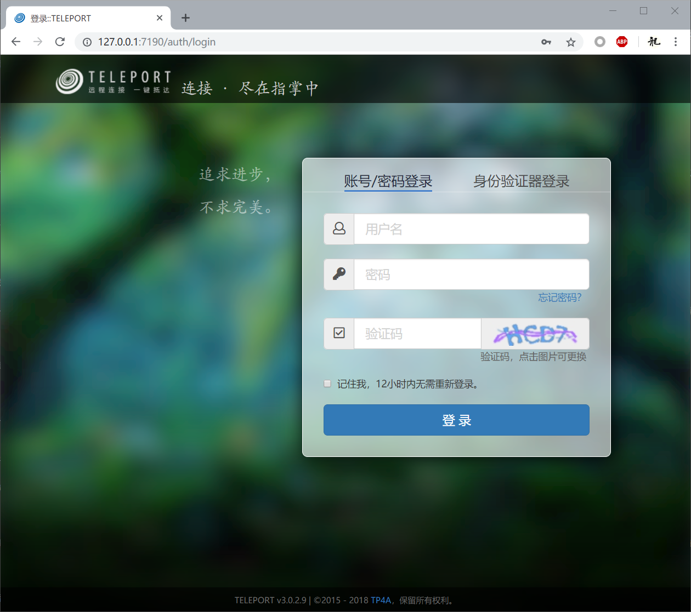
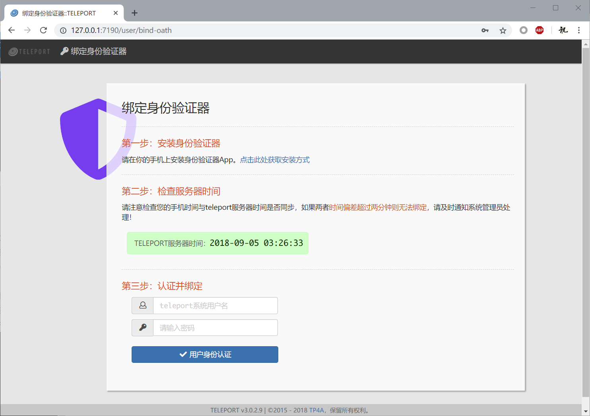
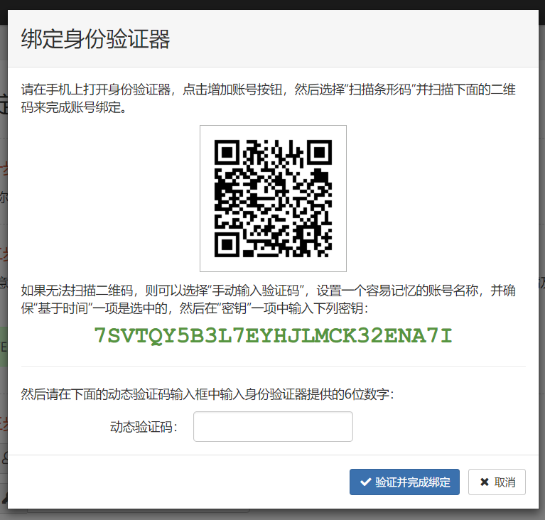

## 一、登录方式

当访问teleport的web服务时，首先需要登录。访问 `http://你的teleport服务器IP:7190` 会显示登录页面：



### 1.1 管理员登录

使用你在安装过程中初始化配置阶段设置的管理员账号和密码登录teleport。管理员登录后可以看到teleport服务器的系统总览：


### 1.2 用户登录

如果teleport配置了邮件服务，且创建用户时指定了用户邮箱，那么用户会收到一封密码邮件，用户可以使用密码邮件中的用户名和密码登录teleport。

如果未配置邮件服务或者没有为用户指定邮箱，那么需要管理员在创建用户之后，使用“重置密码”功能为用户指定密码并通过其他手段通知用户，然后用户可以使用用户名和密码登录teleport。


### 1.3 登录验证方式

目前teleport支持两种验证方式：**账号+密码**，或者 **账号+密码+身份验证器**。管理员可以在系统配置中设置全局的验证方式，比如关闭全局的账号+密码方式，要求所有用户必须使用身份验证器验证。也可以为具体用户单独设置登录验证方式。

### 1.3.1 账号/密码登录

这是标准的登录方式，额外的，还需要输入一个图形验证码。

### 1.3.2 身份验证器登录

要使用身份验证器登录，用户需要首先绑定一个身份验证器。首先切换到“身份验证器登录”界面，点击动态验证码输入框下方的“尚未绑定身份验证器？”链接，打开绑定页面。



根据页面指引，先在手机上安装身份验证器。然后确定手机时间与服务器时间保持同步，之后输入用户名和密码，打开验证并绑定的界面：



用手机上的身份验证器扫描二维码，之后身份验证器会生成随时间变化的6位数字的动态验证码。在下方的输入框中输入这6位数，完成身份验证器的绑定操作。

绑定完成后，就可以返回到登录页面，使用身份验证器生成的动态验证码来登录teleport系统了。

## 二、忘记密码

### 2.1 通过邮箱重置密码

如果你的teleport配置了邮件服务，当用户忘记密码时，可以通过注册的邮箱找回密码。

### 2.2 手动重置管理员密码

如果你忘记了管理员密码，又没有配置邮件服务，无法使用“忘记密码”功能找回密码，目前暂时的做法是直接修改数据库，在teleport数据库的`user`表中，将`id`为`1`的账号的`password`字段设置为以下内容：
```
3:19c9214f9a81ccfc:482ea1ad2859076539ca45b2b97eff266ec0473bea3dcee36f19b87f759d1535
```
然后就可以用密码 **`admin`** 来登录了，未来将提供直接重置管理员密码的工具。

### 2.3 手动重置用户密码

如果teleport未配置邮件服务，或者用户未注册邮箱，那么无法使用找回密码的功能，只能由管理员为用户手动重置密码。
