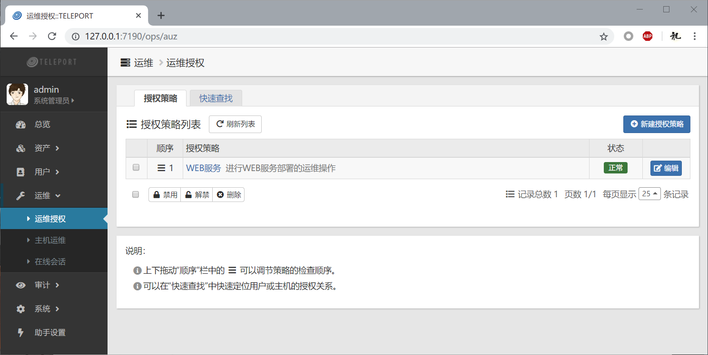
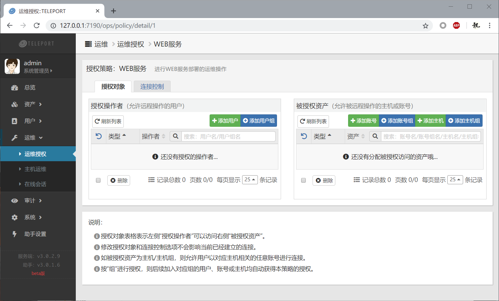
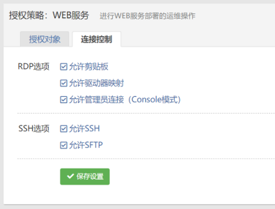
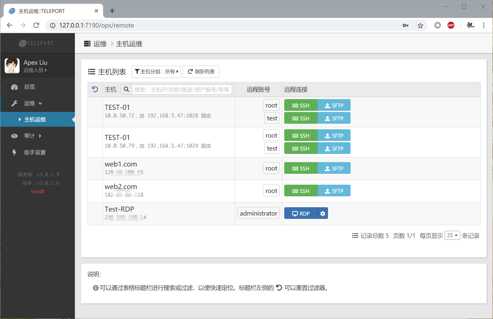
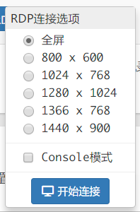
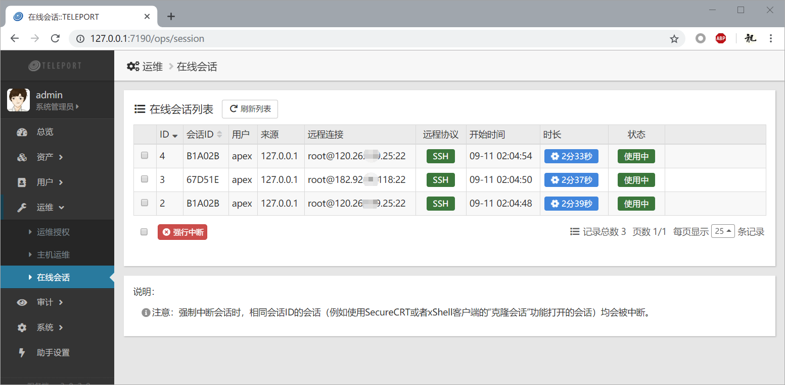

## 一、运维授权

点击展开左侧菜单“运维”项目，然后点击“运维授权”，即可打开运维授权管理页面。只有具备运维授权权限的用户可以查看此界面，并进行授权管理。

具备运维权限的非管理员用户，默认是不能对任何远程主机进行运维操作的，需要具备运维授权权限的用户创建授权策略，并在策略中为其进行授权后，方可在“运维-主机运维”界面中查看到被授权的远程主机和账号，并进行远程连接。

注意，**具备运维授权权限的用户，无需进行授权**就可以以任意远程账号登录对应的主机进行运维操作。

### 1.1 创建授权策略

系统默认是没有做任何授权策略的，点击“新建授权策略”即可创建一个新的授权策略。新创建的授权策略还没有具体授权内容，需要进一步授权操作。

### 1.2 运维授权

所谓授权，就是确定**谁**（授权操作者）可以访问哪些**远程账号**（被授权资产）。点击授权策略列表中的策略名称，会打开授权操作界面：

#### 1.2.1 授权对象

在teleport中，运维授权的最小单位为 **用户 - 远程账号** 的授权关系，表示某个用户可以以某个远程账号的身份登录远程主机进行操作。常见的授权操作为 用户组 - 账号组 的授权。

以“组”的形式加入到授权对象中的，此组的所有成员均会被最终映射到运维授权的最小单位上。因此，合理地使用分组，可以有效提升整个系统的管理效率。

特别注意的是，如果被授权资产是“主机”（或者“主机组”，也即此组内的所有主机），意味着此主机上的每一个账号均会被授权访问。除非有特殊原因，一般不会按主机或主机组进行授权。

授权操作是立即生效的，也就是说，在此界面上进行授权操作后，对应的运维人员在“主机运维”界面刷新页面，就可以看到自己被授权访问的远程主机和账号了。

注意：授权操作不会影响当前已经建立的远程会话连接。如果某个运维用户已经被授权访问某个远程账号，而且当前已经建立了远程连接，此时在授权页面将其授权收回（从列表中移除对应的用户或者被授权资产），那么该远程连接并不会自动断开，你需要在“在线会话”界面中将其强制断开。

#### 1.2.2 连接控制

在授权策略编辑器中，还可以设置此策略的连接控制：

你可以关闭或者开启某些选项，例如，不允许用户通过SFTP上传/下载文件，就可以取消“允许SFTP”的勾选项。

### 1.3 授权策略顺序

当有多条授权策略时，可以在运维授权界面上调整策略的生效顺序，只需要拖动表格中顺序一栏中的数字，上下移动到期望的位置（在表格线的最左侧会出现绿色的指示标记），然后释放鼠标按键即可。

在teleport中，检查用户的运维授权会按以下顺序来进行：

 - 检查用户是否有运维权限（根据用户角色确定其基本权限）；
 - 按顺序取的一条授权策略，检查：
     - 如果此授权策略被禁用，则跳过（相当于此策略未生效）；
     - 如果此策略中，用户-账号 的授权关系第一次出现，则按此策略的连接控制选项授权，否则跳过；
 - 循环处理所有的授权策略，直到授权映射操作完成。

例如，有下列授权策略：

| 顺序 | 策略  | 授权                                                | 连接控制                        |
| :--: | :---: | --------------------------------------------------- | ------------------------------- |
|  1   | 策略1 | 用户A - 账号a 用户B - 账号a 用户B - 账号b | 允许SSH连接 不允许SFTP连接 |
|  2   | 策略2 | 用户A - 账号a 用户B - 账号a 用户B - 账号c | 允许SSH连接 允许SFTP连接   |

那么，当用户A登录后，根据策略1，他可以以SSH方式登录账号a，但不能进行SFTP连接。因为 用户A - 账号a 的授权关系在策略1中已经存在了，所以在策略2中会被忽略。

而当用户B登录后，他可以以SSH方式登录账号a和账号b，但不能进行SFTP连接。同时，他可以以SSH和SFTP的方式登录账号c，因为 用户B - 账号c 的授权关系第一次出现在策略2中，而策略2是允许SSH和SFTP连接的。

注意，在上述例子中，如果策略1被禁用了，那么用户A登录后，就可以以SSH和SFTP方式登录账号a了。

## 二、主机运维

点击“运维-主机运维”即可查看自己能够进行远程连接的主机和账号列表，如下图所示：

点击对应的“远程连接”操作按钮，即可以通过本地助手程序来启动对应的客户端软件，按对应的远程账号连接并登陆到远程主机上。不同的协议可以使用不同的客户端软件，具体操作可以查看“客户端助手”章节。

特别地，对于远程桌面（RDP）来说，点击远程连接按钮右侧的齿轮图标，可以设置更多的连接选项：

其中，“Console模式”，也可称之为“管理员模式”，是早期的Windows服务器的远程桌面连接数有限，当超出上限后，远程桌面连接将无法进行。使用“Console模式”时，远程主机会自动断开一个连接，并允许你登录。

## 三、在线会话

一旦建立了远程连接，在“运维-在线会话”界面就可以查看到这些连接了。

你可以在这里强制中断某些会话。

需要注意的是，强制中断会话时，相同会话ID的会话（例如使用SecureCRT或者xShell客户端的“克隆会话”功能打开的会话）均会被中断。例如上图中，编号为4的会话，就是使用SecureCRT的克隆会话功能在编号为2的会话上建立的新会话，两个会话的会话ID是相同的，强制中断时也会同时中断。