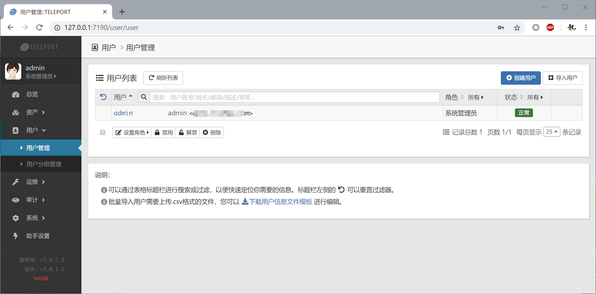
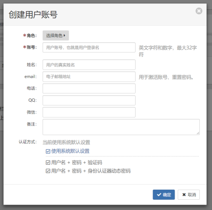

## 一、用户管理

点击页面左侧菜单，展开“用户”项目，然后点击“用户管理”，即可打开用户管理页面。

### 1.1 创建用户

在你安装teleport服务端并进行初始化配置时，系统会自动创建一个管理员用户。

点击页面右上方的“创建用户”按钮，然后在弹出的对话框中填写相关内容：

- **角色**：决定用户的基本权限（可以在“系统-角色管理”中创建或者编辑角色的权限）；
- **账号**：此用户登录teleport系统的用户名；
- email：用户的邮箱，如果设置了邮箱，且系统配置了邮件服务，则可以通过邮箱找回密码；
- **认证方式**：用户登录teleport系统的认证方式，默认使用系统设置，可以在这里为用户单独指定。

与分组的概念不同，一个用户只能有一个角色。角色控制了此用户的基本权限。系统默认设置了三个角色：管理员、运维人员和审计人员。如果某个用户的权限不在此列，例如你希望某个用户既能做运维，又能查看审计数据，那么你需要在“系统-角色管理”中创建一个新的角色，并为此新的角色设定相应的权限，然后为此用户应用此新的角色。

### 1.2 批量导入用户

批量导入用户的操作与批量导入主机和账号的操作很相似，此处不再赘述。

需要注意的是，批量导入的用户是未设定角色的，导入之后，需要为这些用户设定角色。可以使用“批量设置角色”功能快速设置。

## 二、用户分组管理

用户分组主要用于后续的运维授权和审计授权，一个用户可以属于多个不同的用户组，灵活地使用用户分组，可以大大提高授权管理的效率，具体可以参考“[资产管理-分组最佳实践](guide_asset.md#_3)”章节。

**特别注意**：teleport系统使用**最小权限判定规则**，也即，在检查权限时，会按用户所具有的最小权限进行判断。例如：某个用户设定的角色没有远程主机运维权限，那么即使此用户或者此用户所在的用户组被授权访问某远程主机，该用户也无法连接到该远程主机（实际上该用户因为没有远程主机运维权限，就不会为其显示远程运维界面）。

## 三、LDAP用户

### 3.1 配置LDAP

在用户管理界面，点击页面右上方的“LDAP管理”按钮，然后在弹出菜单中点击“设置LDAP”，打开LDAP设置界面。

按界面提示，需要设置LDAP服务器的各项配置信息来授权TP访问该LDAP服务：

- **LDAP主机**：LDAP服务器的IP地址或者域名；
- **端口**：LDAP服务的端口，默认为389；
- **域**：此LDAP的域，为区分TP的本地用户和LDAP用户，在登录时LDAP用户需要用 `用户名@域` 的账号格式来登录，此`域`可以自定义，无需与真正的LDAP域的名称相同，因此可以设置一个简称，比如 `ops`；
- **管理员DN**：LDAP服务的管理员账号，仅用于导入LDAP用户、同步LDAP用户；
- **密码**：LDAP服务的管理员密码；
- **用户基准DN**：在列举用户时，限制用户DN的范围，例如 `ou=dev,ou=company,ou=com`；
- **过滤器**：列举用户时的使用的过滤器，例如 `(&(objectClass=person))`；
- **属性映射**：将LDAP的属性映射到 teleport 的用户属性，例如 Windows 活动目录作为 LDAP 服务使用时，用户属性 `sAMAccountName` 可用于映射为teleport的登录账号。
  - **登录账号字段**：LDAP用户属性中表示用户账号名称的字段，例如 Windows AD中的 `sAMAccountName` `；
  - 真实姓名字段（可选）：LDAP用户属性中表示用户真实姓名的字段，例如 Windows AD中的 `uid`，如果未指定此字段（留空）则默认使用登录账号字段作为用户的真实姓名；
  - 邮箱地址字段（可选）：LDAP用户属性中表示用户账号名称的字段，例如 Windows AD中的 `mail`，如果对应的LDAP用户有配置邮箱地址，则在导入LDAP用户时会向此邮箱发送teleport服务器登录账号通知邮件；

设置过程中，可以点击“列举属性”和“测试获取用户”来检查设置项是否正确。一切无误后请点击“保存设置”来使设置生效。

### 3.2 导入LDAP用户

在用户管理界面，点击页面右上方的“LDAP管理”按钮，然后在弹出菜单中点击“导入LDAP用户”，在已经正确配置了LDAP服务器之后，此功能将列举出LDAP服务器上所有符合过滤条件的用户。

勾选要导入的LDAP用户，然后点击“导入选中的用户”即可。

导入用户后，还需要为用户分配相关的角色。

