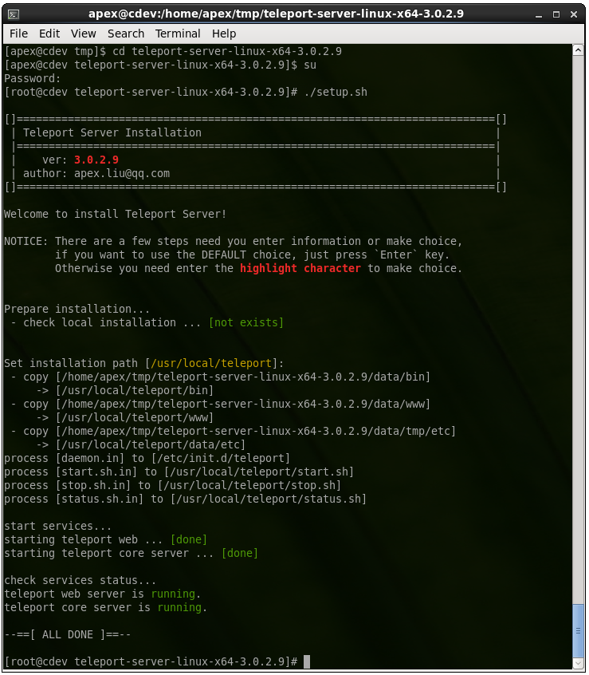
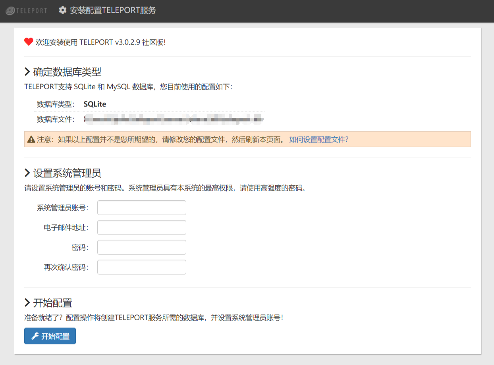
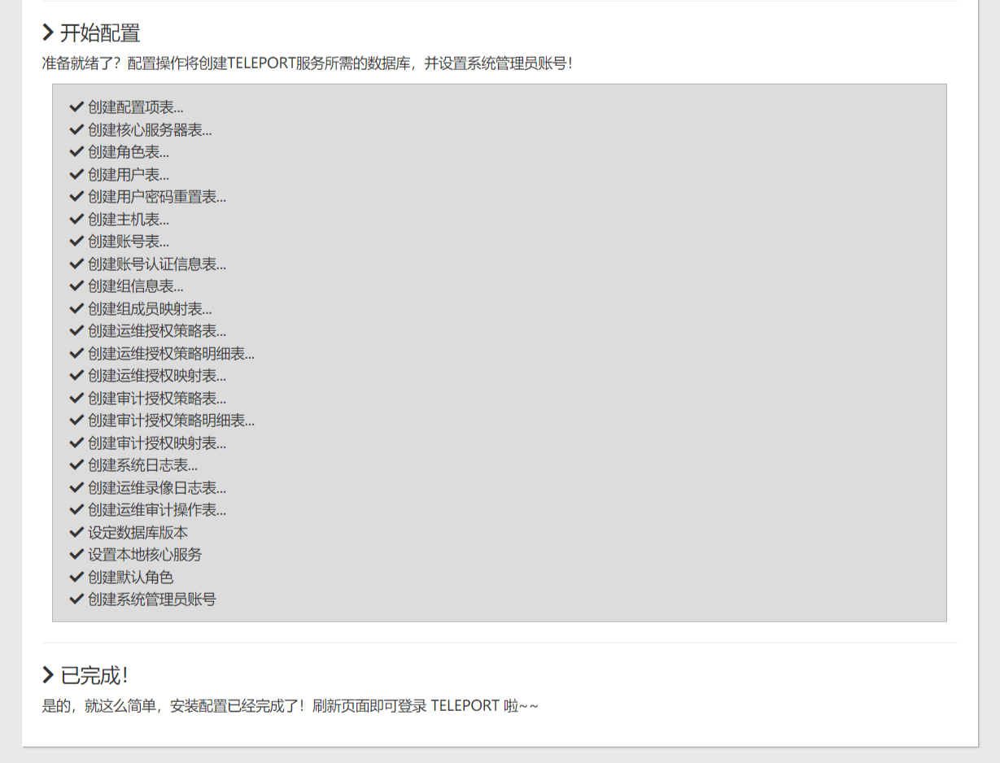
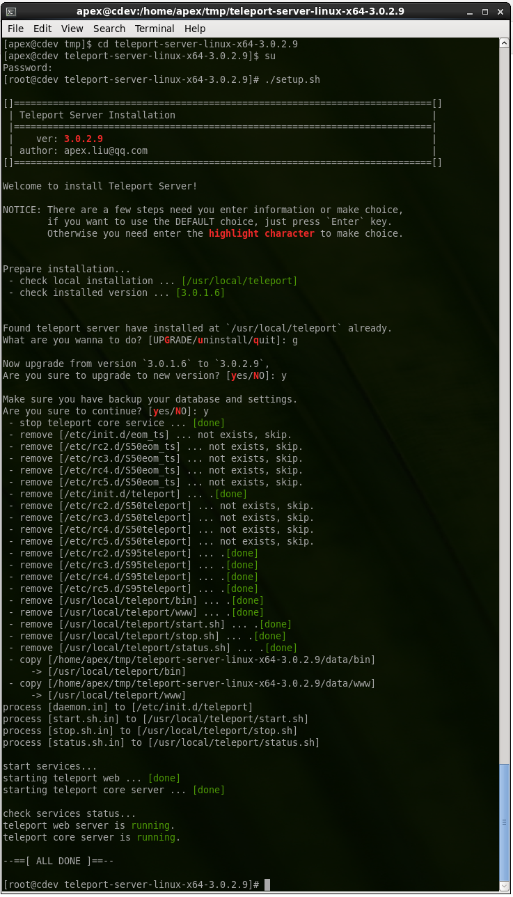

## 一、安装

**本文针对 v3.x 及以上版本进行说明。**


### 1.1 下载并安装

Teleport支持下列Linux平台的部署 _（如果您在其它Linux平台上部署通过，请告知我们）_：

- Ubuntu 14.04 64位 及以上版本
- CentOS 7.0 64位 及以上版本
- Debian 6.0 64位 及以上版本
- Redhat 6.2 64位 及以上版本

Teleport的安装部署非常简单，只需一分钟就可以完成。您需要先[下载二进制安装包](https://www.tp4a.com/download)。为方便理解，本文后续以假定版本 3.0.2.9 为例进行说明。

将下载得到的安装包放到临时目录中，然后执行下列命令：

```bash
tar -zxvf teleport-linux-3.0.2.9.tar.gz
cd teleport-linux-3.0.2.9
sudo ./setup.sh
```

安装时需要指定安装路径，您可以使用默认的安装路径`/usr/local/teleport`（直接回车即可），也可以指定别的路径，请注意**路径中不要含有中文字符或空格**，以避免出现不可预知的错误。默认的录像回放文件位于`/usr/local/teleport/data/replay`目录下，会占用`/usr`的空间，因此建议安装完成后[配置录像回放文件的存储路径](config.md#replay-path)。



仅需几秒钟，安装就完成了，堡垒机的核心服务和WEB服务均已自动启动。您可以访问`http://teleport服务器IP:7190/`来进行初始化设置。

### 1.2 初始化配置

初次安装完成后，可以访问 `http://你的teleport服务器IP:7190/`进行初始化设置。

初始化设置时，需要确定使用的数据库类型。Teleport默认使用内建的sqlite3数据库，因此无需额外安装数据库服务即可开始使用堡垒机的各项功能。如果您希望使用MySQL数据库，请在初始化之前进行[MySQL数据库配置](config.md#use-mysql)。



您需要在这里设置系统管理员的账号和密码，此账号具有系统的最高权限，请务必牢记密码。设置完成后，点击“开始配置”按钮即可完成初始配置工作了：



初始化配置完成后，刷新页面即可进入teleport的登录界面。


------------------------

## 二、升级

!!! Danger "警告"
    升级之前，请确保备份了您的数据！！升级过程中也会再次提示您备份数据！

### 2.1 备份数据

默认情况下，teleport的配置文件、数据文件等均放在 `/usr/local/teleport/data` 目录下，因此，您可以将此目录进行备份即可。需要注意的是，默认的录像回放文件也在此目录下，因此有可能数据量会比较大。

### 2.2 下载并升级

一旦备份完成，就可以进行升级了。升级过程也很简单，与安装过程基本一致。您需要下载最新的安装包，解压，然后以 root 身份运行压缩包中的 setup.sh 脚本，像这样：

```bash
tar -zxvf teleport-linux-3.0.2.9.tar.gz
cd teleport-linux-3.0.2.9
sudo ./setup.sh
```

安装脚本会自动检测当前已经安装的版本和路径，并询问要执行的操作。这里我们要升级，按提示，输入 `g` 并回车，然后会确认升级以及确认已经对数据进行了备份，这里我们输入 `y` 并回车进行确认，之后，安装脚本会停止teleport的服务，复制新版本的文件，然后重新启动服务，就像这样：



---------------------------------------

## 三、服务控制<a id="server-control"></a>

Teleport 有两个服务：核心服务 `core` 和网页服务 `web`。两个服务可以同时启动、停止、重启，也可单独操作其中的一个。

操作完整的 teleport 服务：

  - 启动： `/etc/init.d/teleport start`
  - 停止： `/etc/init.d/teleport stop`
  - 重启： `/etc/init.d/teleport restart`
  - 查看运行状态： `/etc/init.d/teleport status`

仅操作核心服务 core：

  - 启动： `/etc/init.d/teleport start core`
  - 停止： `/etc/init.d/teleport stop core`
  - 重启： `/etc/init.d/teleport restart core`

仅操作网页服务 web：

  - 启动： `/etc/init.d/teleport start web`
  - 停止： `/etc/init.d/teleport stop web`
  - 重启： `/etc/init.d/teleport restart web`

